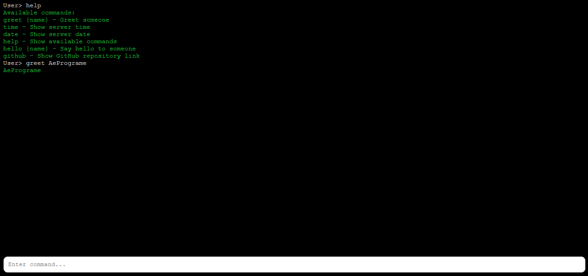

# PHP Console



## About

A simple PHP console with a terminal-like frontend, allowing users to create custom commands and interact with the system.

## Overview

This project provides a basic PHP console that can be used to execute commands and interact with the system. The frontend is designed to resemble a terminal, providing a familiar interface for users.

## Features

* **Customizable commands**: Create your own commands using PHP functions and register them with the console.
* **Terminal-like interface**: Interact with the console using a terminal-like interface, complete with command history and auto-completion.
* **Error handling**: The console provides basic error handling.

## Requirements

* PHP 8.3 or later

## Installation

1. Clone the repository to your desired location.

## Usage

1. Run `php -S 127.0.0.1:8000` or replace the `8000` port with the port you want.
2. Open a web browser and navigate to the console URL (e.g. `http://localhost`).
3. Type commands into the terminal-like interface to interact with the system.
4. Use the `help` command to view a list of available commands and their usage.

## Creating Custom Commands

1. Open `Console.php` file in `Inc` Directory.
2. Add the command using `Command::add` function.

Example:

``` php

// Inc/Console.php
Command::add('greet {name}', fn($name) => $name, 'Greet someone');

```

## Credits

* the HTML-structure and some styling from `ChatGPT`.
